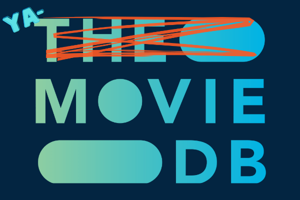

<!-- Original template: https://github.com/othneildrew/Best-README-Template/pull/73 -->
<a name="readme-top"></a>

<!-- PROJECT SHIELDS -->
<!-- [![Contributors][contributors-shield]][contributors-url]
[![Forks][forks-shield]][forks-url]
[![Stargazers][stars-shield]][stars-url]
[![Issues][issues-shield]][issues-url]
-->
[](https://github.com/mattnieland/YAMDB/actions/workflows/yamdb-dev.yml)
[](https://github.com/mattnieland/YAMDB/actions/workflows/yamdb-main.yml)

[![MIT License][license-shield]][license-url]
[![LinkedIn][linkedin-shield]][linkedin-url]

<!-- PROJECT LOGO -->
<br />
<div align="center">
  <a href="https://github.com/mattnieland/YAMDB">
    
  </a>

  <h3 align="center">YAMDB (Yet Another Movie Db)</h3>

  <p align="center">
    <a href="https://github.com/mattnieland/YAMDB"><strong>Explore the docs »</strong></a>
    <br />
    <br />
    <a href="https://github.com/mattnieland/YAMDB">View Demo</a>
    ·
    <a href="https://github.com/mattnieland/YAMDB/issues">Report Bug</a>
    ·
    <a href="https://github.com/mattnieland/YAMDB/issues">Request Feature</a>
  </p>
</div>


<!-- TABLE OF CONTENTS -->
<details>
  <summary>Table of Contents</summary>
  <ol>
    <li>
      <a href="#about-the-project">About The Project</a>
      <ul>
        <li><a href="#built-with">Built With</a></li>
      </ul>
    </li>
    <li>
      <a href="#getting-started">Getting Started</a>
      <ul>
        <li><a href="#prerequisites">Prerequisites</a></li>
        <li><a href="#installation">Installation</a></li>
      </ul>
    </li>    
    <li><a href="#contributing">Contributing</a></li>
    <li><a href="#license">License</a></li>
    <li><a href="#contact">Contact</a></li>
    <li><a href="#acknowledgments">Acknowledgments</a></li>
  </ol>
</details>


<!-- ABOUT THE PROJECT -->
## About The Project

* /swagger
![Product Name Screen Shot][product-screenshot]

* /graphql
![Product Name Screen Shot2][product-screenshot2]

I created this project for a coding assessment for a job.  I looped
so many concepts into this project that I decided to make it
a public template for my future API projects.

<p align="right">(<a href="#readme-top">back to top</a>)</p>


### Built With

This API was built with the following tools:

* [![.NET][.NET]][.NET-url]
* [![EFCORE][EFCORE]][EFCORE-url]
* [![Docker][Docker]][Docker-url]
* [![Doppler][Doppler]][Doppler-url]
* [![Auth0][Auth0]][Auth0-url]
* [![Swagger][Swagger]][Swagger-url]
* [![Sentry][Sentry]][Sentry-url]
* [![Serilog][Serilog]][Serilog-url]
* [![HotChocolate][HotChocolate]][HotChocolate-url]
* [![NuGet][NuGet]][NuGet-url]
* [![ReSharper][ReSharper]][ReSharper-url]
* [![Canva][Canva]][Canva-url]

<p align="right">(<a href="#readme-top">back to top</a>)</p>


<!-- GETTING STARTED -->
## Getting Started

The default template uses in memory database and seeds
its data from TheMovieDb.  You can enable/disable any of the "extras" like Doppler, Auth0, Sentry, Serilog or HotChocolate.  If you'd like to use all of these,
read on.

### Prerequisites
You need the following pre-requisites to run thi project:
* A TheMovieDb API key (refer to this documentation: https://developers.themoviedb.org/3/getting-started/introduction)
* A Doppler account with a project (use local/dev/prod config environments)
* An Auth0 account (create an API using this guide: https://auth0.com/docs/quickstart/backend/aspnet-core-webapi/interactive)
* A Sentry account (use this guide to get a DSN https://docs.sentry.io/platforms/dotnet/guides/aspnetcore)
* Logging is provided by Serilog and dumps to Azure Table Storage (If you'd like a different sink, refer to this list: https://github.com/serilog/serilog/wiki/Provided-Sinks)

### Installation

To start, apply the following tokens to your Doppler configs:
  ```sh
  THEMOVIEDB_API_KEY = Your TheMovieDb API key
  AUTH0_AUTHORITY = Your Auth0 Domain
  AUTH0_AUDIENCE = Your audience identifier (can be the anything)
  SENTRY_DSN = Your Sentry DSN from above
  LOGGING_CONNECTION_STRING = Your Azure Table Storage Connection String (If you don't have this key, logging will be skipped in setup)  
  ```

To access the doppler secrets, get a Doppler token and add a : to it (Doppler uses Basic Auth).  Refer to this page for how to authenticate to the Doppler API: https://docs.doppler.com/reference/api.

Finally, base64 encode (https://www.base64encode.org) the string and run the following command in the YAMDB.csproj folder:

* Set Doppler Token
  ```sh
  dotnet user-secrets set "DOPPLER_TOKEN" "YOUR_DOPPLER_TOKEN_HERE"
  ```

That's it!  You're ready to compile and run via Visual Studio or VS Code.

<p align="right">(<a href="#readme-top">back to top</a>)</p>


<!-- CONTRIBUTING -->
## Contributing

Contributions are what make the open source community such an amazing place to learn, inspire, and create.

If you have a suggestion that would make this better, please fork the repo and create a pull request. You can also simply open an issue with the tag "enhancement".
Don't forget to give the project a star! Thanks again!

1. Fork the Project
2. Create your Feature Branch (`git checkout -b feature/AmazingFeature`)
3. Commit your Changes (`git commit -m 'Add some AmazingFeature'`)
4. Push to the Branch (`git push origin feature/AmazingFeature`)
5. Open a Pull Request

<p align="right">(<a href="#readme-top">back to top</a>)</p>


<!-- LICENSE -->
## License

Distributed under the MIT License. See `LICENSE.txt` for more information.

<p align="right">(<a href="#readme-top">back to top</a>)</p>


<!-- CONTACT -->
## Contact

Matt Nieland - https://www.linkedin.com/in/mattnieland - matt.nieland@gmail.com
Project Link: [https://github.com/mattnieland/YAMDB](https://github.com/mattnieland/YAMDB)

<p align="right">(<a href="#readme-top">back to top</a>)</p>


<!-- ACKNOWLEDGMENTS -->
## Acknowledgments

* [Choose an Open Source License](https://choosealicense.com)
* [Img Shields](https://shields.io)
* https://hodo.dev/posts/post-03-dynamic-filter-ef for Dynamic Filtering code
* https://www.c-sharpcorner.com/blogs/rate-limiting-in-net-60 for rate limiting logic

<p align="right">(<a href="#readme-top">back to top</a>)</p>

<!-- MARKDOWN LINKS & IMAGES -->
[contributors-shield]: https://img.shields.io/github/contributors/othneildrew/Best-README-Template.svg?style=for-the-badge
[contributors-url]: https://github.com/mattnieland/YAMDB/graphs/contributors
[forks-shield]: https://img.shields.io/github/forks/othneildrew/Best-README-Template.svg?style=for-the-badge
[forks-url]: https://github.com/mattnieland/YAMDB/network/members
[stars-shield]: https://img.shields.io/github/stars/othneildrew/Best-README-Template.svg?style=for-the-badge
[stars-url]: https://github.com/mattnieland/YAMDB/stargazers
[issues-shield]: https://img.shields.io/github/issues/othneildrew/Best-README-Template.svg?style=for-the-badge
[issues-url]: https://github.com/mattnieland/YAMDB/issues
[license-shield]: https://img.shields.io/github/license/othneildrew/Best-README-Template.svg?style=for-the-badge
[license-url]: https://github.com/mattnieland/YAMDB/blob/main/LICENSE.txt
[linkedin-shield]: https://img.shields.io/badge/-LinkedIn-black.svg?style=for-the-badge&logo=linkedin&colorB=555
[linkedin-url]: https://www.linkedin.com/in/mattnieland
[product-screenshot]: images/screenshot.png
[product-screenshot2]: images/screenshot2.png
[.NET]: https://img.shields.io/badge/.NET-512BD4?style=for-the-badge&logo=.net
[.NET-url]: https://learn.microsoft.com/en-us/aspnet/core/?view=aspnetcore-6.0
[EFCORE]: https://img.shields.io/badge/Entity%20Framework-512BD4?style=for-the-badge
[EFCORE-url]: https://learn.microsoft.com/en-us/ef/core
[Docker]: https://img.shields.io/badge/Docker-000000?style=for-the-badge&logo=Docker
[Docker-url]: https://www.docker.com
[Auth0]: https://img.shields.io/badge/Auth0-000000?style=for-the-badge&logo=Auth0
[Auth0-url]: https://auth0.com
[Swagger]: https://img.shields.io/badge/Swagger-000000?style=for-the-badge&logo=Swagger
[Swagger-url]: https://swagger.io
[Doppler]: https://img.shields.io/badge/Doppler-000000?style=for-the-badge
[Doppler-url]: https://www.doppler.com
[Sentry]: https://img.shields.io/badge/Sentry-362D59?style=for-the-badge&logo=Sentry
[Sentry-url]: https://sentry.io
[Serilog]: https://img.shields.io/badge/Serilog-000000?style=for-the-badge
[Serilog-url]: https://serilog.net
[HotChocolate]: https://img.shields.io/badge/HotChocolate-000000?style=for-the-badge
[HotChocolate-url]: https://chillicream.com/docs/hotchocolate
[NuGet]: https://img.shields.io/badge/NuGet-004880?style=for-the-badge&logo=NuGet
[NuGet-url]: https://www.nuget.org
[ReSharper]: https://img.shields.io/badge/ReSharper-000000?style=for-the-badge&logo=ReSharper
[ReSharper-url]: https://www.jetbrains.com/resharper
[Canva]: https://img.shields.io/badge/Canva-000000?style=for-the-badge&logo=Canva
[Canva-url]: https://www.canva.com
